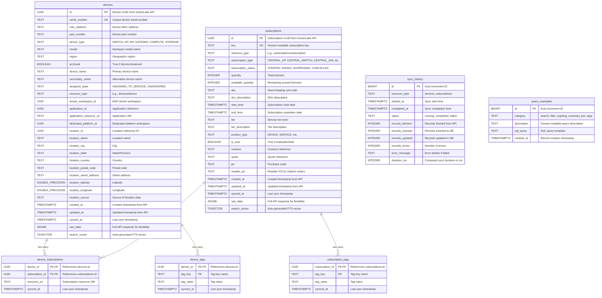

# Database Schema ER Diagram

This diagram shows the core database schema for the HPE GreenLake Device & Subscription Sync platform.

## Entity Relationship Diagram

## Key Relationships

### Many-to-Many: Devices ↔ Subscriptions
- **device_subscriptions** table acts as a junction table
- One device can have multiple subscriptions
- One subscription can cover multiple devices
- Implements the M:M relationship between devices and their subscription licenses

### One-to-Many: Devices ↔ Device Tags
- Each device can have multiple tags (key-value pairs)
- Tags are normalized into **device_tags** table for efficient querying
- Also available in JSONB format within `devices.raw_data` for flexibility

### One-to-Many: Subscriptions ↔ Subscription Tags
- Each subscription can have multiple tags (key-value pairs)
- Tags are normalized into **subscription_tags** table
- Also available in JSONB format within `subscriptions.raw_data`

### Tracking Table: Sync History
- **sync_history** table is independent (no foreign keys)
- Tracks all synchronization operations for both devices and subscriptions
- Provides audit trail and sync metrics

### Reference Table: Query Examples
- **query_examples** table is independent
- Stores example SQL queries for LLM/AI assistants
- Categorized by query type (search, filter, expiring, etc.)

## Important Views

The schema includes several materialized views for common queries:

- **active_devices** - Non-archived devices only
- **active_subscriptions** - Active (STARTED) subscriptions only
- **devices_expiring_soon** - Devices with subscriptions expiring in 90 days
- **subscriptions_expiring_soon** - Subscriptions expiring in 90 days
- **devices_with_subscriptions** - Denormalized view joining devices and subscriptions
- **device_summary** - Aggregated device counts by type and region
- **subscription_summary** - Aggregated subscription counts by type and status
- **schema_info** - Schema metadata for LLM understanding
- **valid_column_values** - Valid categorical values with occurrence counts

## Important Functions

- **search_devices(query, limit)** - Full-text search with ranking
- **get_devices_by_tag(key, value)** - Tag-based device lookup

## Data Storage Philosophy

The schema follows a **hybrid approach**:

1. **Normalized fields** - Frequently queried fields are extracted to table columns with indexes
2. **JSONB raw_data** - Complete API response stored for flexibility and future-proofing
3. **Full-text search** - Auto-generated `tsvector` columns enable fast search
4. **Normalized tags** - Tags extracted to separate tables for efficient filtering

This design optimizes for:
- Fast common queries (using indexed columns)
- Flexibility (using JSONB for complex/rare queries)
- Maintainability (API changes don't break existing queries)
- Performance (strategic indexes, covering indexes, partial indexes)

## Indexing Strategy

### Primary Indexes
- Primary keys on all tables (UUID for entities, composite for junction tables)
- Unique indexes on natural keys (serial_number, subscription key)

### Query Optimization Indexes
- B-tree indexes on frequently filtered columns (device_type, region, subscription_status, etc.)
- GIN indexes for full-text search (search_vector columns)
- GIN indexes for JSONB queries (raw_data columns)
- Composite indexes for common multi-column filters
- Covering indexes to enable index-only scans
- Partial indexes for common WHERE clause patterns

### Performance Features
- Generated columns for computed values (search_vector, duration_ms)
- Partial indexes for active/non-archived records
- JSONB path operators for nested data access
- PostgreSQL extensions: uuid-ossp, pg_trgm, pgvector (for AI features)
