# Database Schema ER Diagram

This diagram shows the core database schema for the HPE GreenLake Device & Subscription Sync platform.

## Entity Relationship Diagram

```mermaid
erDiagram
    devices ||--o{ device_subscriptions : "has many"
    subscriptions ||--o{ device_subscriptions : "has many"
    devices ||--o{ device_tags : "has many"
    subscriptions ||--o{ subscription_tags : "has many"
    sites ||--o{ clients : "has many"
    devices ||--o{ clients : "connected via serial"
    agent_conversations ||--o{ agent_messages : "has many"
    agent_conversations ||--o{ agent_memory : "source tracking"
    agent_messages ||--o{ agent_memory : "source tracking"
    agent_memory ||--o{ agent_memory_revisions : "has many"
    agent_embedding_jobs ||--|| agent_messages : "targets (polymorphic)"
    agent_embedding_jobs ||--|| agent_memory : "targets (polymorphic)"

    devices {
        UUID id PK "Device UUID from GreenLake API"
        TEXT serial_number UK "Unique device serial number"
        TEXT mac_address "Device MAC address"
        TEXT part_number "Device part number"
        TEXT device_type "SWITCH, AP, IAP, GATEWAY, COMPUTE, STORAGE"
        TEXT model "Hardware model name"
        TEXT region "Geographic region"
        BOOLEAN archived "True if decommissioned"
        TEXT device_name "Primary device name"
        TEXT secondary_name "Alternative device name"
        TEXT assigned_state "ASSIGNED_TO_SERVICE, UNASSIGNED"
        TEXT resource_type "e.g., devices/device"
        UUID tenant_workspace_id "MSP tenant workspace"
        UUID application_id "Application reference"
        TEXT application_resource_uri "Application URI"
        UUID dedicated_platform_id "Dedicated platform workspace"
        UUID location_id "Location reference ID"
        TEXT location_name "Location name"
        TEXT location_city "City"
        TEXT location_state "State/Province"
        TEXT location_country "Country"
        TEXT location_postal_code "Postal code"
        TEXT location_street_address "Street address"
        DOUBLE_PRECISION location_latitude "Latitude"
        DOUBLE_PRECISION location_longitude "Longitude"
        TEXT location_source "Source of location data"
        TIMESTAMPTZ created_at "Created timestamp from API"
        TIMESTAMPTZ updated_at "Updated timestamp from API"
        TIMESTAMPTZ synced_at "Last sync timestamp"
        TEXT firmware_version "Current firmware version"
        TEXT firmware_recommended_version "Recommended firmware version"
        TEXT firmware_upgrade_status "Firmware upgrade status"
        TEXT firmware_classification "Firmware version classification"
        TIMESTAMPTZ firmware_last_upgraded_at "Last firmware upgrade timestamp"
        TIMESTAMPTZ firmware_synced_at "Firmware info last sync timestamp"
        JSONB raw_data "Full API response for flexibility"
        TSVECTOR search_vector "Auto-generated FTS vector"
    }

    subscriptions {
        UUID id PK "Subscription UUID from GreenLake API"
        TEXT key UK "Human-readable subscription key"
        TEXT resource_type "e.g., subscriptions/subscription"
        TEXT subscription_type "CENTRAL_AP, CENTRAL_SWITCH, CENTRAL_GW, etc."
        TEXT subscription_status "STARTED, ENDED, SUSPENDED, CANCELLED"
        INTEGER quantity "Total licenses"
        INTEGER available_quantity "Remaining unused licenses"
        TEXT sku "Stock keeping unit code"
        TEXT sku_description "SKU description"
        TIMESTAMPTZ start_time "Subscription start date"
        TIMESTAMPTZ end_time "Subscription expiration date"
        TEXT tier "Service tier level"
        TEXT tier_description "Tier description"
        TEXT product_type "DEVICE, SERVICE, etc."
        BOOLEAN is_eval "True if evaluation/trial"
        TEXT contract "Contract reference"
        TEXT quote "Quote reference"
        TEXT po "Purchase order"
        TEXT reseller_po "Reseller PO for indirect orders"
        TIMESTAMPTZ created_at "Created timestamp from API"
        TIMESTAMPTZ updated_at "Updated timestamp from API"
        TIMESTAMPTZ synced_at "Last sync timestamp"
        JSONB raw_data "Full API response for flexibility"
        TSVECTOR search_vector "Auto-generated FTS vector"
    }

    device_subscriptions {
        UUID device_id PK,FK "References devices.id"
        UUID subscription_id PK,FK "References subscriptions.id"
        TEXT resource_uri "Subscription resource URI"
        TIMESTAMPTZ synced_at "Last sync timestamp"
    }

    device_tags {
        UUID device_id PK,FK "References devices.id"
        TEXT tag_key PK "Tag key name"
        TEXT tag_value "Tag value"
        TIMESTAMPTZ synced_at "Last sync timestamp"
    }

    subscription_tags {
        UUID subscription_id PK,FK "References subscriptions.id"
        TEXT tag_key PK "Tag key name"
        TEXT tag_value "Tag value"
        TIMESTAMPTZ synced_at "Last sync timestamp"
    }

    sync_history {
        BIGINT id PK "Auto-increment ID"
        TEXT resource_type "devices, subscriptions"
        TIMESTAMPTZ started_at "Sync start time"
        TIMESTAMPTZ completed_at "Sync completion time"
        TEXT status "running, completed, failed"
        INTEGER records_fetched "Records fetched from API"
        INTEGER records_inserted "Records inserted to DB"
        INTEGER records_updated "Records updated in DB"
        INTEGER records_errors "Number of errors"
        TEXT error_message "Error details if failed"
        INTEGER duration_ms "Computed sync duration in ms"
    }

    query_examples {
        BIGINT id PK "Auto-increment ID"
        TEXT category "search, filter, expiring, summary, join, tags"
        TEXT description "Human-readable query description"
        TEXT sql_query "SQL query template"
        TIMESTAMPTZ created_at "Record creation timestamp"
    }

    sites {
        TEXT site_id PK "Unique site identifier from Aruba Central"
        TEXT site_name "Human-readable site name"
        TIMESTAMPTZ last_synced_at "Last sync timestamp"
        TIMESTAMPTZ created_at "Record creation timestamp"
        TIMESTAMPTZ updated_at "Record update timestamp"
    }

    clients {
        BIGINT id PK "Auto-increment ID"
        TEXT site_id FK "References sites.site_id"
        MACADDR mac UK "Client MAC address (unique per site)"
        TEXT name "Client device name"
        TEXT health "Good, Fair, Poor, Unknown"
        TEXT status "Connected, Disconnected, Failed, Blocked, REMOVED"
        TEXT status_reason "Reason for current status"
        TEXT type "Wired or Wireless"
        INET ipv4 "IPv4 address"
        INET ipv6 "IPv6 address"
        TEXT network "Network name"
        TEXT vlan_id "VLAN identifier"
        TEXT port "Connected port"
        TEXT role "Client role/profile"
        TEXT connected_device_serial "Serial number of connected device"
        TEXT connected_to "Name of connected device"
        TIMESTAMPTZ connected_since "Connection start timestamp"
        TIMESTAMPTZ last_seen_at "Last seen timestamp"
        TEXT tunnel "Port-based, User-based, Overlay"
        INTEGER tunnel_id "Tunnel identifier"
        TEXT key_management "Security key management method"
        TEXT authentication "Authentication method"
        TEXT capabilities "Client capabilities"
        JSONB raw_data "Full API response from Aruba Central"
        TIMESTAMPTZ created_at "Record creation timestamp"
        TIMESTAMPTZ updated_at "Record update timestamp"
        TIMESTAMPTZ synced_at "Last sync timestamp"
    }

    agent_conversations {
        UUID id PK "Conversation UUID"
        TEXT tenant_id "Tenant identifier for multi-tenancy"
        TEXT user_id "User who owns this conversation"
        TEXT title "Conversation title"
        TEXT summary "Auto-generated summary for long conversations"
        INTEGER message_count "Count of messages in conversation"
        TIMESTAMPTZ created_at "Created timestamp"
        TIMESTAMPTZ updated_at "Updated timestamp"
        JSONB metadata "Additional conversation metadata"
    }

    agent_messages {
        UUID id PK "Message UUID"
        UUID conversation_id FK "References agent_conversations.id"
        TEXT role "user, assistant, system, tool"
        TEXT content "Message content"
        TEXT thinking_summary "Redacted CoT summary (raw CoT never stored)"
        JSONB tool_calls "Tool call details with correlation IDs"
        VECTOR_3072 embedding "🔷 pgvector: Semantic embedding for search"
        TEXT embedding_model "Model used (e.g., text-embedding-3-large)"
        INTEGER embedding_dimension "Actual dimension used"
        TEXT embedding_status "pending, processing, completed, failed"
        TEXT model_used "LLM model used for this message"
        INTEGER tokens_used "Token count for this message"
        INTEGER latency_ms "Response latency in milliseconds"
        TIMESTAMPTZ created_at "Created timestamp"
    }

    agent_memory {
        UUID id PK "Memory UUID"
        TEXT tenant_id "Tenant identifier"
        TEXT user_id "User identifier"
        TEXT memory_type "fact, preference, entity, procedure"
        TEXT content "Memory content"
        TEXT content_hash "SHA-256 hash for deduplication"
        VECTOR_3072 embedding "🔷 pgvector: Semantic embedding for search"
        TEXT embedding_model "Model used for embedding"
        INTEGER embedding_dimension "Actual dimension used"
        INTEGER access_count "Number of times accessed"
        TIMESTAMPTZ last_accessed_at "Last access timestamp"
        UUID source_conversation_id FK "References agent_conversations.id (nullable)"
        UUID source_message_id FK "References agent_messages.id (nullable)"
        TIMESTAMPTZ valid_from "Valid from timestamp"
        TIMESTAMPTZ valid_until "Valid until timestamp (NULL = forever)"
        FLOAT confidence "Confidence score 0-1"
        BOOLEAN is_invalidated "Soft delete flag"
        TIMESTAMPTZ created_at "Created timestamp"
        TIMESTAMPTZ updated_at "Updated timestamp"
        JSONB metadata "Additional memory metadata"
    }

    agent_embedding_jobs {
        UUID id PK "Job UUID"
        TEXT tenant_id "Tenant identifier"
        TEXT target_table "agent_messages or agent_memory"
        UUID target_id "ID of target record"
        TEXT status "pending, processing, completed, failed, dead"
        INTEGER retries "Retry count"
        INTEGER max_retries "Maximum retries (default 3)"
        TEXT error_message "Error details if failed"
        TIMESTAMPTZ locked_at "Lock timestamp for SKIP LOCKED pattern"
        TEXT locked_by "Worker ID for debugging"
        TIMESTAMPTZ created_at "Created timestamp"
        TIMESTAMPTZ processed_at "Processed timestamp"
    }

    agent_audit_log {
        UUID id PK "Audit log UUID"
        TEXT tenant_id "Tenant identifier"
        TEXT user_id "User identifier"
        TEXT action "Action performed (e.g., add_device)"
        TEXT resource_type "Resource type (e.g., device, subscription)"
        TEXT resource_id "ID of affected resource"
        JSONB payload "Request payload"
        JSONB result "Response/result"
        TEXT status "pending, completed, failed, conflict"
        TEXT error_message "Error details if failed"
        TEXT idempotency_key "Client-provided key for retry safety"
        TIMESTAMPTZ created_at "Created timestamp"
        TIMESTAMPTZ completed_at "Completed timestamp"
    }

    agent_sessions {
        UUID id PK "Session UUID"
        TEXT tenant_id "Tenant identifier"
        TEXT user_id "User identifier"
        TEXT session_type "confirmation, operation, context, cache"
        TEXT key "Unique key within session type"
        JSONB data "Session data"
        TIMESTAMPTZ expires_at "Expiration timestamp (NULL = no expiration)"
        TIMESTAMPTZ created_at "Created timestamp"
        TIMESTAMPTZ updated_at "Updated timestamp"
    }

    agent_patterns {
        UUID id PK "Pattern UUID"
        TEXT tenant_id "Tenant identifier"
        TEXT pattern_type "tool_success, query_response, error_recovery, workflow"
        TEXT trigger_text "What triggers this pattern"
        TEXT trigger_hash "SHA-256 hash for deduplication"
        VECTOR_3072 trigger_embedding "🔷 pgvector: Semantic embedding for pattern matching"
        TEXT embedding_model "Model used for embedding"
        INTEGER embedding_dimension "Actual dimension used"
        TEXT response "Expected response/action"
        JSONB context "Additional context"
        INTEGER success_count "Number of successes"
        INTEGER failure_count "Number of failures"
        FLOAT confidence "Success rate confidence score"
        TIMESTAMPTZ last_used_at "Last use timestamp"
        BOOLEAN is_active "Active flag"
        TIMESTAMPTZ created_at "Created timestamp"
        TIMESTAMPTZ updated_at "Updated timestamp"
    }

    agent_memory_revisions {
        UUID id PK "Revision UUID"
        UUID memory_id FK "References agent_memory.id"
        TEXT tenant_id "Tenant identifier"
        TEXT user_id "User identifier"
        INTEGER version "Version number"
        TEXT version_state "current, superseded, corrected, merged"
        TEXT content "Revision content"
        TEXT previous_content "Previous content for diff"
        TEXT change_reason "Reason for change"
        TEXT changed_by "User who made change (null = system)"
        FLOAT confidence "Confidence score 0-1"
        JSONB metadata "Additional revision metadata"
        TIMESTAMPTZ created_at "Created timestamp"
    }
```

## Key Relationships

### Many-to-Many: Devices ↔ Subscriptions
- **device_subscriptions** table acts as a junction table
- One device can have multiple subscriptions
- One subscription can cover multiple devices
- Implements the M:M relationship between devices and their subscription licenses

### One-to-Many: Devices ↔ Device Tags
- Each device can have multiple tags (key-value pairs)
- Tags are normalized into **device_tags** table for efficient querying
- Also available in JSONB format within `devices.raw_data` for flexibility

### One-to-Many: Subscriptions ↔ Subscription Tags
- Each subscription can have multiple tags (key-value pairs)
- Tags are normalized into **subscription_tags** table
- Also available in JSONB format within `subscriptions.raw_data`

### Tracking Table: Sync History
- **sync_history** table is independent (no foreign keys)
- Tracks all synchronization operations for both devices and subscriptions
- Provides audit trail and sync metrics

### Reference Table: Query Examples
- **query_examples** table is independent
- Stores example SQL queries for LLM/AI assistants
- Categorized by query type (search, filter, expiring, etc.)

### One-to-Many: Sites ↔ Clients
- **sites** table represents physical locations from Aruba Central
- Each site can have multiple network clients (WiFi/Wired devices)
- **clients** table stores devices connected to network equipment
- Foreign key: `clients.site_id` references `sites.site_id`
- Cascading delete: removing a site removes all associated clients

### One-to-Many: Devices ↔ Clients
- Network clients connect to network devices (APs, switches, gateways)
- Relationship via **clients.connected_device_serial** column
- Links to **devices.serial_number** (not enforced as FK for flexibility)
- Enables queries like "show all clients connected to device X"
- Function `get_clients_by_device(serial)` provides convenient lookup

### Firmware Enrichment for Devices
- Devices table enhanced with firmware tracking columns
- Tracks current version, recommended version, upgrade status
- Enables firmware compliance monitoring and update planning
- View **devices_firmware_status** provides computed upgrade status

### Agent Chatbot Relationships

#### One-to-Many: Conversations ↔ Messages
- **agent_conversations** represents a chat session between a user and the AI agent
- **agent_messages** stores individual messages within a conversation
- Foreign key: `agent_messages.conversation_id` references `agent_conversations.id`
- Cascading delete: removing a conversation removes all its messages
- Trigger automatically updates `message_count` in conversations table

#### One-to-Many: Conversations/Messages ↔ Memory
- **agent_memory** stores long-term extracted facts, preferences, entities, and procedures
- Source tracking via nullable foreign keys to conversations and messages
- `source_conversation_id` references `agent_conversations.id` (ON DELETE SET NULL)
- `source_message_id` references `agent_messages.id` (ON DELETE SET NULL)
- Allows memories to persist even after source conversations are deleted

#### One-to-Many: Memory ↔ Memory Revisions
- **agent_memory_revisions** tracks version history for memories
- Foreign key: `agent_memory_revisions.memory_id` references `agent_memory.id`
- Cascading delete: removing a memory removes all its revisions
- Partial unique index ensures only one "current" version per memory
- Enables correction, rollback, and audit trails for memory changes

#### Polymorphic Relationship: Embedding Jobs ↔ Messages/Memory
- **agent_embedding_jobs** is a work queue for background embedding generation
- `target_table` + `target_id` creates a polymorphic relationship
- Can target either `agent_messages` or `agent_memory` tables
- Unique constraint prevents duplicate jobs for the same target
- Uses SKIP LOCKED pattern for concurrent worker processing

#### Independent Tables
- **agent_sessions** - Persistent session storage (no foreign keys, TTL-based cleanup)
- **agent_patterns** - Learned interaction patterns (tenant-scoped, no foreign keys)
- **agent_audit_log** - Write operation audit trail (tenant-scoped, no foreign keys)

#### pgvector Embedding Columns 🔷
Three tables use **pgvector** for semantic search with vector(3072) dimension:
- **agent_messages.embedding** - Message semantic embeddings for conversational context retrieval
- **agent_memory.embedding** - Memory semantic embeddings for long-term knowledge retrieval
- **agent_patterns.trigger_embedding** - Pattern trigger embeddings for learned behavior matching

All embedding columns include:
- `embedding_model` - Tracks which model generated the embedding (e.g., "text-embedding-3-large")
- `embedding_dimension` - Actual dimension used (supports multiple models with different dimensions)
- **Note**: Column dimension is 3072 to support multiple models, but pgvector indexes only support up to 2000 dimensions. Sequential scan is used for similarity searches, which is acceptable for moderate data sizes.

## Important Views

The schema includes several materialized views for common queries:

- **active_devices** - Non-archived devices only
- **active_subscriptions** - Active (STARTED) subscriptions only
- **devices_expiring_soon** - Devices with subscriptions expiring in 90 days
- **subscriptions_expiring_soon** - Subscriptions expiring in 90 days
- **devices_with_subscriptions** - Denormalized view joining devices and subscriptions
- **device_summary** - Aggregated device counts by type and region
- **subscription_summary** - Aggregated subscription counts by type and status
- **schema_info** - Schema metadata for LLM understanding
- **valid_column_values** - Valid categorical values with occurrence counts
- **active_clients** - Network clients excluding removed/deleted clients, joined with site names
- **sites_with_stats** - Sites with dynamic client and device counts (connected, wired, wireless, health)
- **clients_health_summary** - Aggregated client statistics across all sites (status, type, health)
- **devices_firmware_status** - Devices with firmware information and computed upgrade status
- **agent_active_conversations** - Active conversations (updated in last 30 days) with message counts and last message
- **agent_memory_stats** - Memory statistics per user grouped by memory type (total, active, confidence)
- **agent_embedding_queue_status** - Embedding job queue status by tenant, target table, and status
- **agent_active_sessions** - Active sessions with TTL remaining calculations
- **agent_pattern_summary** - Pattern learning summary by tenant and pattern type
- **agent_memory_revision_stats** - Memory revision statistics by tenant and user

## Important Functions

- **search_devices(query, limit)** - Full-text search with ranking
- **get_devices_by_tag(key, value)** - Tag-based device lookup
- **search_clients(query, limit)** - Search clients by MAC address, name, or IP
- **get_clients_by_device(serial)** - Get all clients connected to a specific device
- **agent_memory_cleanup(tenant_id)** - Lifecycle management: invalidates expired memories, decays unused, deletes old
- **agent_track_memory_access(memory_id)** - Updates access count and timestamp when memory is retrieved
- **agent_cleanup_expired_sessions(tenant_id)** - Removes expired session data (run periodically)
- **agent_decay_pattern_confidence(days_unused, decay_factor, tenant_id)** - Decays confidence for unused patterns
- **agent_pattern_stats(tenant_id)** - Returns pattern learning statistics by type

## Data Storage Philosophy

The schema follows a **hybrid approach**:

1. **Normalized fields** - Frequently queried fields are extracted to table columns with indexes
2. **JSONB raw_data** - Complete API response stored for flexibility and future-proofing
3. **Full-text search** - Auto-generated `tsvector` columns enable fast search
4. **Normalized tags** - Tags extracted to separate tables for efficient filtering

This design optimizes for:
- Fast common queries (using indexed columns)
- Flexibility (using JSONB for complex/rare queries)
- Maintainability (API changes don't break existing queries)
- Performance (strategic indexes, covering indexes, partial indexes)

## Indexing Strategy

### Primary Indexes
- Primary keys on all tables (UUID for entities, composite for junction tables)
- Unique indexes on natural keys (serial_number, subscription key)

### Query Optimization Indexes
- B-tree indexes on frequently filtered columns (device_type, region, subscription_status, etc.)
- GIN indexes for full-text search (search_vector columns)
- GIN indexes for JSONB queries (raw_data columns)
- Composite indexes for common multi-column filters
- Covering indexes to enable index-only scans
- Partial indexes for common WHERE clause patterns

### Performance Features
- Generated columns for computed values (search_vector, duration_ms)
- Partial indexes for active/non-archived records
- JSONB path operators for nested data access
- PostgreSQL extensions: uuid-ossp, pg_trgm, pgvector (for AI features)
